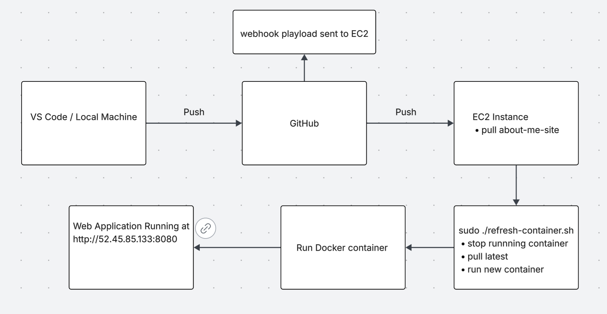

# Project 5

### Additional Notes
- New AWS account, so created new instances using cf temp from Project 3 
- [CF Template](./BISWA-lb-cf.yml)
- **New SSH to proxy:** ssh -i ~/.ssh/project5-key.pem ubuntu@52.45.85.133
- Added Security group Inbound rules to allow from 8080
- **Disabled main.yml workflow from GitHub manually based on your feedback on P4**

---
# Part 1 - Script a Refresh
1. **EC2 Instance Details**
- **AMI information:** Ubuntu 22.04 (ami id: ami-0ecb62995f68bb549)
- **Instance type:** t2.medium (2 CPU core & 4 GB RAM)
- **Recommended volume size:** 30 GB
- **Security Group configuration:**
  - allow SSH from trusted ip address
  - allow http port (80) and application port (8080) from anywhere (I had to do this so that I could run about-me-site from EC2 instance)
- **Security Group configuration justification / explanation:**
  - HTTP port open so website is accessible
  - SSH is restricted to known IPs
  - only the needed ports for web application is opened

2. **Docker Setup on OS on the EC2 instance**
- **How to install Docker for OS on the EC2 instance**
  ```bash
    sudo apt update
    sudo apt install -y docker.io
    sudo systemctl enable docker
    sudo systemvtl start docker 
    ```
- **Additional dependencies based on OS on the EC2 instance**
  - install Git "sudo apt install -y git" 
- **How to confirm Docker is installed and that OS on the EC2 instance can successfully run containers**
  - Confirm docker: `docker --version`
  - Verify container run: `sudo docker run -d -p 8080:80 kiranrdm/about-me-site:latest`

3. **Testing on EC2 Instance**
- **How to pull container image from DockerHub repository**
  - `sudo docker pull kiranrdm/about-me-site:latest`
- **How to run container from image**
  - `sudo docker run -d -p 8080:80 kiranrdm/about-me-site:latest`
- **Note the differences between using the -it flag and the -d flags and which you would recommend once the testing phase is complete**
  - `-it` iteractive terminal -- used for debugging 
  - `-d` detached mode -- runs container in the background
  - I prefer using `-d` because it runs in the background and also because I am not familiar with `it`
- **How to verify that the container is successfully serving the web application**
  - `docker ps` -- lists running containers
  - check website in my case the url is http://52.45.85.133:8080

4. **Scripting Container Application Refresh**
- **Description of the bash script**
  - stops and removes any running containers 
  - pulls the latest tagged image from my DockerHub repo
  - starts a new container on detached mode on port 8080
  - uses `--restart ubless-stopped` to auto start on system reboot
- **How to test / verify that the script successfully performs its taskings**
  - first make sure the script is executable: chmod +x scriptname.sh
  - in my instance this is what i did:
    - `cd deployment`
    - `sudo ./refresh-container.sh`
    - `sudo docker ps` -- confirm that new container is running 
- [Bash Script Link](./deployment/refresh-container.sh)

---
# Part 2 - Listen
1. **Configuring a webhook Listener on EC2 Instance**
- **How to install adnanh's webhook to the EC2 instance**
  - sudo apt update --> sudo apt install webhook
- **How to verify successful installation**
  - webhook --versin (this outputs webhook version 2.8.0 on ec2)
- **Summary of the webhook definition file**
  - `execute-command` -- points to the bash script that refreshes the Docker container
  - `command-working-directory` -- points to `deployment` directory
  - `trigger-rule` -- ensures payloads are from a trusted source using a shared secret
- **How to verify definition file was loaded by webhook**
  - `sudo webhook -hooks /home/ubuntu/deployment/hooks.json -verbose -port 9000`
- **How to verify webhook is receiving payloads that trigger it**
  - how to monitor logs from running webhook
    - `sudo journalctl -u webhook.service -f` -- show live logs for webhook service 
  - what to look for in docker process views
    - run `sudo docker ps` and look for correct container name and image tag
- [LINK to definition file in repository](./deployment/hooks.json)

2. **Configure a webhook Service on EC2 Instance**
- **Summary of webhook service file contents**
  - in my EC2 instance it is in `/usr/lib/systemd/system/webhook.service`
  - removed `ConditionPathExists` line and added `After=network.target`
  - `ExecStart` -- command that runs when service starts 
    - loads hooks file, shows logs, and listens onport 9000
  - `WorkingDirectory=/home/ubuntu/deployment` -- service runs in `deployment` folder
  - `Restart=on-failure` -- webhook auto restarts if crashes
- **How to enable and start the webhook service**
  ```bash
    sudo systemctl daemon-reload
    sudo systemctl enable webhook.service
    sudo systemctl start webhook.service
    sudo systemctl status webhook.service
  ```
- **How to verify webhook service is capturing payloads and triggering bash script**
  - `sudo journalctl -u webhook.service -f` -- checks logs from webhook service
- [LINK to service file in repository](./deployment/webhook.service)

---
# Part 3 - Send a Payload
1. **Configuring a Payload Sender**
- **Justification for selecting GitHub or DockerHub as the payload sender**
  - I choose DockerHub as it is directly tied to images and I thought it would be easier than using GitHub. Also in your lecture you mentioned that you prefered DockerHub so I figured I'd use it as well. 
- **How to enable your selection to send payloads to the EC2 webhook listener**
  - go to your repo in DockerHub 
  - click on webhooks (in the nav bar)
  - under New Webhook enter name and webhook URL 
  - press the add/plus on the right -- save the webhook
- **Explain what triggers will send a payload to the EC2 webhook listener**
  - When i push a new image it will send a payload to the ec2 webhook listener. 
- **How to verify a successful payload delivery**
  - in DockerHub -> repo -> wehbhooks -> under your webhook: click on the 3 dots and click history to view history and you'll see the status. 
- **How to validate that your webhook only triggers when requests are coming from appropriate sources (GitHub or DockerHub)**
  - any request not coming from http://52.45.85.133:9000/hooks/refresh-site will not trigger the script  

my DockerHub webhook:
webhook name: refresh-site-webhook
webhook URL: http://52.45.85.133:9000/hooks/refresh-site

---
# Part 4 - Project Description & Diagram 
1. **Continuous Deployment Project Overview**
- **What is the goal of this project**
  - The goal is to deploy a web application on an EC2 instance using Docker and automate its refresh whenever a new Docker image is pushed. This ensures the application always runs the latest version without manual intervention.

- **What tools are used in this project and what are their roles**
  - **VS Code** - work on my Github repos and to build and push images to DockerHub
  - **AWS EC2** - hosts web application container
  - **GitHub** - where my Porject repo is 
  - **BashScript** - to write `refresh-container.sh` it stops old containers, pulls latest image and starts new container
  - **Docker** - what runs the application as containers 
  - **DockerHub** - stores docker images 
  - **Webhook** - listesn for incoming payloads and triggers refresh-container.sh

- **Diagram of project**  


## What is NOT WORKING in this project
  - This is the issue we ran into durning our demo: I was able to run the web from my local host but when I made the changes and pulled it in my ec2 instance there were some issues that I can't really put words to. The web page was no longer showing -- mostly like issue with container not being built properly but my refresh-container.sh is working properly. I cloned my GitHub repo in EC2 instance and manually ran the web and the web ran fine. 


## Reference / Resource Used
- [adnanh webhook](https://github.com/adnanh/webhook)

- I prmpoted ChatGPT to give me a better CSS for my web, something that's appealing but easy on the eye. 

- When testing Docker image on my ec2 instance, I got this platform compatabilty error ```Error response from daemon: no matching manifest for linux/amd64 in the manifest list entries: no match for platform in manifest: not found``` which I wasnt sure how to fix and I gave ChatGPT this error message and it walked me through to do this on my local machine (MacOS) `docker buildx build --platform linux/amd64 -t kiranrdm/about-me-site:latest ./web-content` and then i pushd it to DockerHub and pulled the container in my EC2 instance and it worked. 

- I used this `https://github.com/adnanh/webhook` and the lecture videos in Pilot to get and idea of how to write hooks. 

- I didn't use this but it kind of just helped me understand it a little. This is how i got my webhook.service, by doing `sudo vim /usr/lib/systemd/system/webhook.service`. I wasnt sure about webhook service file so i prompted ChatGPT for an example of a webhook.service since I couldnt find one in [adnanh webhook](https://github.com/adnanh/webhook).  
  This is what it gave me:
  ```bash 
  [Unit]
  Description=Webhook Service
  After=network.target

  [Service]
  ExecStart=/usr/local/bin/webhook -hooks /path/to/hooks.json -verbose
  Restart=on-failure
  User=webhook
  Group=webhook
  WorkingDirectory=/path/to

  [Install]
  WantedBy=multi-user.target
  ```
  **Along with these explanations:**
    - ExecStart → runs the webhook with your config
    - Restart=on-failure → restarts if it crashes
    - User and Group → limits permissions for security
    - WantedBy=multi-user.target → standard systemd target for services

- While preping for the Live-Demo thinsgs were working fine and am not sure what I did but eveything kind of broke. I refered to ai and asked it some debugging type of questions. My suspicion was either my `hooks.json` or r`efresh-container.sh` so I pasted my code into there. I had also mentioned that I was using Dockerhub and was so posed to validate DockerHub repo and it poointed out that I was using secrets from GitGub and not DockerHub. SO i fixed it to use 

- During the final preparation phase for the live demonstration, the automated Continuous Deployment (CD) pipeline unexpectedly broke. Although the Continuous Integration (CI) steps (building the image and pushing to DockerHub) were successful, the server deployment was not triggering.  
  I suspected that iut was something to do with the hooks or the refresh-container and I reviewed it in my VS code and didn't see anything that stuck out tp me as they were working properly. 
  I put my code into Gemini and it pointed this out:
    1. my hooks was using X-Hub-Signature to validate incoming request which is used for GitHub and not DockerHub(this is what I've choosen to use for webhook) -- I had originally scrapped that code from [adnanh webhook](https://github.com/adnanh/webhook)
   - I fixed the code to validate using my DockerHub repo name  


I fixed them and tried them again but I had forgotten that hooks.json if originally from my EC2 instance and so I had to go in there adn update that as well which i mispelled somethings there and it took a lot of time for me to realize that and fix it.  

**Another thing I Did**: This wasn't ai but one of my friend, advised that maybe I could delete all the images and containers since I have pushed it DockerHub I can just pull it afterwards and I did that as well -- this might've help in other ways but it did help clean out all the clutters I had.  

Afterwards I reastarted the service and also started building it from start again and it after those fixes it worked -- till we encountered an issue durning our demo which I've mentioned up top --> [Not Working Section](#what-is-not-working-in-this-project). 